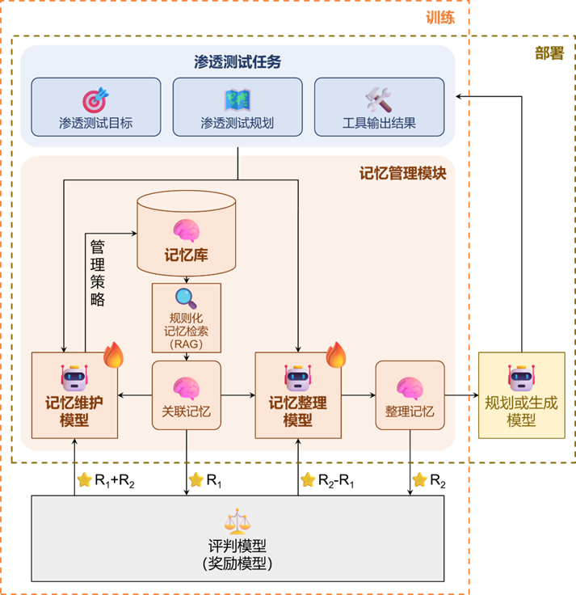

# 面向自动化渗透测试的主动记忆管理技术

## 主要研究内容

本研究面向LLM驱动的自动化渗透测试系统在任务执行中出现的关键信息遗忘、记忆冗余与冲突、有效上下文缺失等问题，从以下三方面展开：

### 记忆维护模型

针对渗透测试工具原始输出信息密度低、环境噪声干扰及重复动作导致的记忆冗余与矛盾问题，构建基于较小规模LLM的记忆维护模型。该模型以增量方式对记忆库条目执行增、删、改、不变四类更新操作，实现冗余过滤、矛盾消解与关键信息强化，确保记忆库的长期一致性与高效性。

### 记忆整理模型
针对LLM过度依赖近期任务而忽略历史攻击面的问题，设计记忆整理模型。该模型以当前测试子任务、全局规划及RAG召回记忆为输入，经强化学习训练后，输出与下一步决策最相关高质量记忆子集并构建具有引导性的提示词，提升后续模型的规划与生成质量。

### 渗透测试记忆库

构建面向渗透测试任务记忆库，设计实现高效的存取接口与更新机制，支撑记忆维护模型与记忆整理模型的运作。



图1  记忆管理模块的架构与训练方法

## 仓库目录结构

- `MemoryModule`
  - `src` : 源代码
    - `memory_module` : 记忆模块主体代码
    - `core` : 记忆模块核心代码
      - `framework.py` : 记忆模块的整体逻辑, 实现了 `MemoryModule` 类
      - `memory_bank.py` : 记忆库, 实现了 `MemoryBank` 类
      - `memory_maintainer.py` : 记忆维护模块, 实现了 `MemoryMaintainer` 类
      - `memory_consolidator.py` : 记忆整理模块, 实现了 `MemoryConsolidator` 类
    - `utils` : 工具类
      - `model.py` : 模型类, 包括 `ChatModel` `EmbeddingModel` 两个类
      - `prompt.py` : 读取 `prompts/` 目录中的提示词`
    - `prompts` : 提示词
      - `prompt-model-A.md` : 记忆维护的策略选择阶段的提示词
      - `prompt-model-Aplus.md` : 记忆维护的记忆条目内容生成阶段的提示词
      - `prompt-model-B.md` : 记忆整理的筛选阶段的提示词
      - `prompt-model-Bplus.md` : 记忆整理的格式化记忆内容整理阶段的提示词
    - `config` : 用于配置的代码
      - `llm_config.py` : LLM 配置文件, 用于配置 LLM 的 API
      - `llm_config_template.json` : LLM 配置模板
    - `__init__.py` : 暴露了 `MemoryModule` `MemoryBank` `MemoryMaintainer` `MemoryConsolidator` `ChatModel` `EmbeddingModel` 几个类用于调用
  - `data` : 用于调试的数据集和调试过程的数据
    - `final_label` : [渗透测试轨迹数据](https://github.com/ct5ctl/2601_pentest_memory_data), 可用于调试代码
    - `yyyymmdd_hhmmss` : 调试过程的观测 / 工具输出结果原文, 每个以 `<session_id>_<step_id>_<时间>.txt` 的文件名命名 (目前尚未完成会话暂停和恢复)
  - `database` : 存储记忆的数据库
    - `yyyy-mm-dd_hh-mm-ss` : 单次运行的数据库 (记忆库)
      - `chroma` : 记忆条目的向量数据库 (待记忆原文和记忆元数据拼接后生成 embedding, 不建议从这里获取记忆条目内容)
      - `sqlite.db` : 记忆条目的数据库 (包括记忆条目的内容、元数据)
  - `images` : `README.md` 中所展示的图片
  - `offline_running.py` : 使用 data/final_label/ 目录中的数据集对代码进行调试
  - `session.json` : 会话 ID 和数据库文件路径 (目前尚未完成会话暂停和恢复)
  - `pyproject.toml` : 项目依赖包配置文件 (尚未写好)
  - `README.md` : 仓库说明

其他未提及文件是老版本遗留文件和代码或者用于调试和测试的文件

## 运行方式

记忆模块设计为一个可嵌入的模块, 本身没有完整的运行方式, 可以在其他代码中调用记忆模块的 API

也可以使用 `offline_running.py` 脚本使用预先构建的数据集对记忆模块的代码进行调试

首先安装如下依赖包:

```bash
pip install sqlite
pip install chromadb
pip install openai
pip install pathlib
```

运行如下代码以可编辑模式安装记忆模块 (尚未完成 `pyproject.toml` 的依赖配置, 请自行添加依赖):

```bash
pip install -e .
```

在工作目录或 `~/.config/memory_module/` 中创建一个配置文件 `llm_config.py`，并填写对应的 API 密钥，格式参考 `src/config/llm_config_template.json`。

然后可以通过如下代码导入记忆模块:

```pyton
from memory_module import MemoryModule
```

`MemoryModule` 类使用方式请参考 `offline_running.py` 脚本，该脚本展示了如何使用 `MemoryModule` 类处理渗透测试的工具输出。

## 技术路线

当前LLM驱动的渗透测试系统在记忆管理方面存在关键信息遗忘、信息冗余及记忆冲突等问题，导致系统在规划时出现动作循环重复、忽视测试中暴露的潜在攻击面等现象，进而影响渗透测试的完成度。本论文旨在构建一个嵌入自动化渗透测试系统的记忆管理模块，该模块专门用于维护渗透测试记忆，为系统的规划和动作生成提供高质量上下文。

### 记忆管理模块架构

该记忆管理模块包含三个主要部件：记忆维护模型、记忆整理模型和记忆库。图1展示了该模块的整体流程：在每个渗透测试步骤中，记忆维护模型接收渗透测试目标、渗透测试规划、当前步骤工具输出结果以及通过RAG筛选出的关联记忆条目，负责决定是否添加、修改、删除或不变更记忆条目，从而实现冗余过滤与记忆更新，维护系统对于渗透测试环境与漏洞信息的记忆；更新后，记忆整理模型获取RAG筛选出的关联记忆，并结合渗透测试的总体规划和前后若干动作的规划，筛选并整理出有助于引导后续模型进行高效、准确的规划或生成的记忆；最终，后续模型借助记忆管理模块生成的记忆进行规划或动作生成。
 
### 记忆管理模块强化学习过程

图1中还呈现了记忆维护模型和记忆整理模型的训练方法。本论文拟采用规模较小的LLM作为记忆维护模型和记忆整理模型，并在离线专家轨迹数据上采用基于PPO或GRPO的强化学习方法进行参数高效微调，以提升两模型在渗透测试任务中的记忆管理能力。本论文将使用冻结的LLM作为评判模型，为记忆维护模型和记忆整理模型提供奖励信号，初步方案拟采用GPT系列模型的API作为该评判模型的实现。评判模型将在训练期间接收来自记忆管理模块的两组信息：第一组为直接使用RAG检索得到的关联记忆及包含一个正确工具调用命令、多个不相关冗余命令的选项集；第二组为经记忆整理模型整理后的记忆与相同选项集。通过API调用获取GPT选择正确选项的概率并以此作为奖励函数的重要组成部分。设R1为提供第一组信息后的正确概率，R2为提供第二组信息后的正确概率。R1与R2之和反映了记忆管理策略对后续决策的效果，作为记忆维护模型的奖励反馈信号；R2与R1之差则反映了记忆整理模型对检索的记忆条目的质量提升效果，作为该模型的奖励反馈信号。本论文拟采用Pentest-R1构建的专家轨迹数据集，该数据集包含500条人工渗透测试的观察与命令记录，专家轨迹数据经噪声注入处理后输入记忆维护模型进行训练和预测，并将其中命令与无关命令混合后输入评判模型用于评判两个模型的训练效果。

训练完成后，将嵌入记忆管理模块的自动化渗透测试系统部署在Kali虚拟机上，借助Kali虚拟机上的渗透测试工具，对AutoPenBench、Hack The Box或XBOW benchmark等常用基准测试中的靶机进行渗透测试，对比添加记忆管理模块前后的渗透测试成功率、子任务完成率、步骤总数及重复步骤数等指标变化，并开展消融实验以验证记忆维护模型、记忆整理模型各自的作用。

